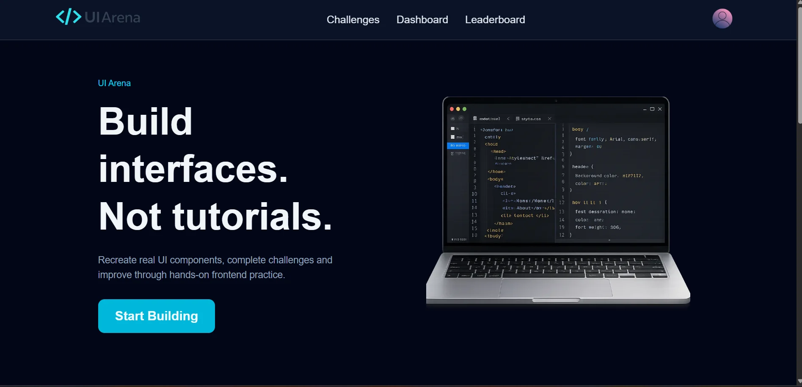
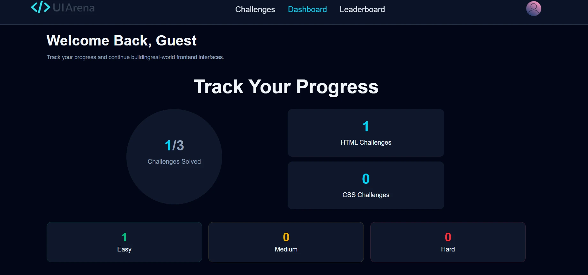
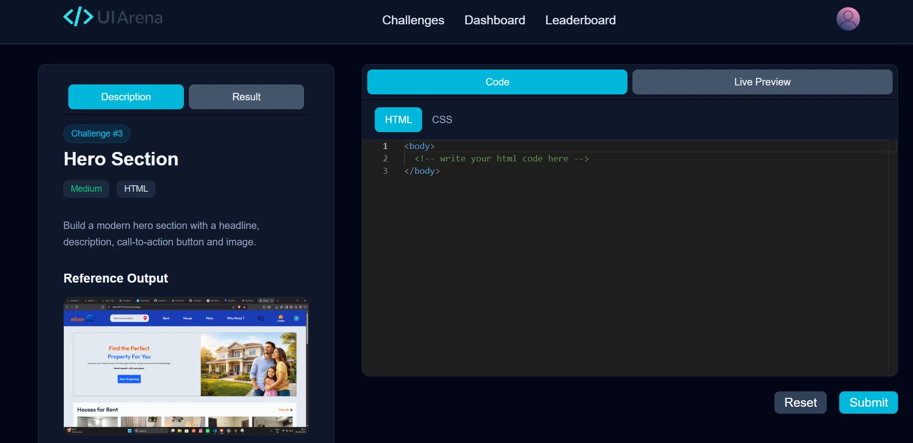

# 🚀 UI Arena – Frontend Challenge Platform

UI Arena is a full-stack frontend challenge platform that helps developers practice real-world HTML and CSS challenges inside an interactive coding environment. Users can write code in a live editor, preview their output instantly, track progress, earn points, and compete on a global leaderboard.

## 🌐 Live Demo

**Frontend:** https://ui-arena.vercel.app

**Admin Panel:** https://ui-arena-lx8r.vercel.app

**Backend API:** https://ui-arena-backend.onrender.com

---

## ✨ Key Highlights

* 💻 Live HTML & CSS Sandbox with Monaco Editor
* ⚡ Real-Time Code Preview
* 🎯 25+ Frontend Coding Challenges
* 📊 Progress Tracking Dashboard
* 🏆 Global Leaderboard System
* 🔖 Bookmark & Continue Learning Workflow
* 🔐 JWT Authentication & Protected Routes
* 🚀 Lighthouse Performance Score: 97

---

## ✨ Features

### 💻 Interactive Coding Environment

* Monaco Editor Integration
* Live HTML & CSS Preview
* Real-Time Code Testing
* Challenge Submission System

### 🎯 Challenge System

* Practice Real-World Frontend Challenges
* Search Challenges
* Filter by Category & Difficulty
* Challenge Progress Tracking
* Completion Status Management

### 📊 Dashboard

* Track Overall Progress
* Challenge Completion Statistics
* Difficulty-Wise Performance Breakdown
* Recent Activity Tracking
* Continue Learning Workflow

### 🏆 Leaderboard

* Global User Rankings
* Points-Based Scoring
* Competitive Learning Experience

### 👤 User Profile

* Profile Management
* Profile Image Upload
* Bookmark Management
* Account Overview

### 🔐 Authentication

* User Registration & Login
* JWT Authentication
* Protected Routes

### ⚡ Performance Optimizations

* Route-Based Lazy Loading
* WebP Image Optimization
* Loading States for Better UX
* Scroll Restoration on Route Changes
* Custom Favicon
* Lighthouse Performance Score of 97

---

## 🛠️ Tech Stack

### Frontend

* React.js
* React Router
* Tailwind CSS
* Axios
* Framer Motion
* Monaco Editor

### Backend

* Node.js
* Express.js
* MongoDB Atlas
* Mongoose

### Authentication & Media Storage

* JWT Authentication
* Cloudinary

### Deployment

* Vercel
* Render

---

## 📈 Performance Highlights

* Reduced image payload size by over **80%** using WebP optimization.
* Achieved a **Lighthouse Performance Score of 97**.
* Implemented **route-based code splitting** using React Lazy Loading.
* Improved user experience through optimized asset delivery and loading states.

---

## 🚀 Installation

### Clone Repository

```bash
git clone https://github.com/ravikiran1411/UI_Arena.git
```

### Frontend Setup

```bash
cd frontend
npm install
npm run dev
```

### Backend Setup

```bash
cd backend
npm install
npm run server
```

### Environment Variables

Backend `.env`

```env
MONGODB_URI=
JWT_SECRET=
CLOUDINARY_CLOUD_NAME=
CLOUDINARY_API_KEY=
CLOUDINARY_API_SECRET=
```

Frontend `.env`

```env
VITE_BACKEND_URL=
```

---

## 📸 Screenshots

### 🏠 Home Page



### 📊 Dashboard



### 💻 Challenge Details



---

## 👨‍💻 Author

**Ravi Kiran**

LinkedIn: https://www.linkedin.com/in/ravi-kiran-8a9484366

GitHub: https://github.com/ravikiran1411

Built with ❤️ using the MERN Stack.
